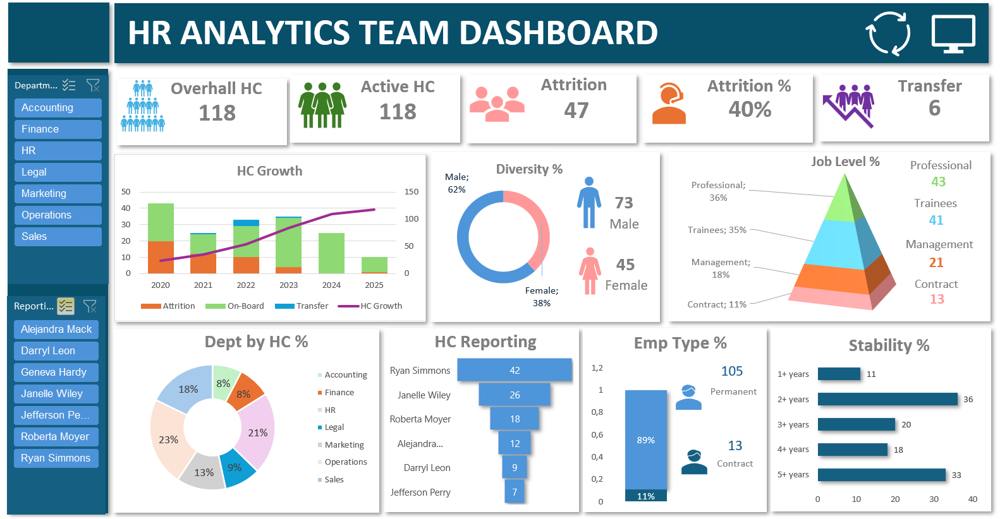
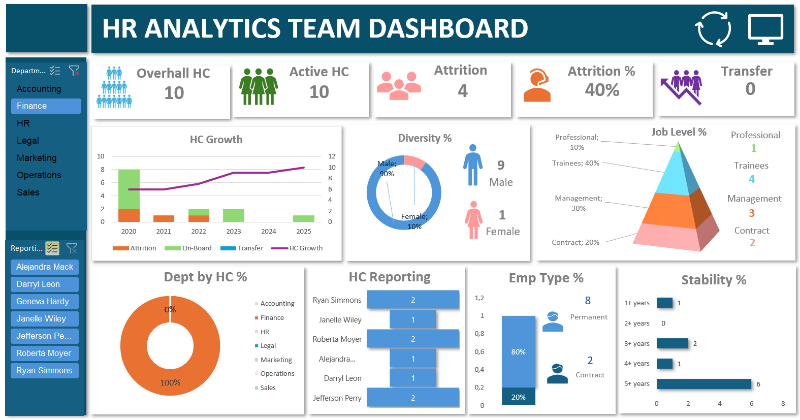

# 📊 Dashboard de Workforce e Attrition

Este projeto apresenta um **Dashboard de Workforce e Attrition** desenvolvido no **Microsoft Excel**.

O dashboard apresenta uma visão consolidada do quadro de funcionários, admissões, desligamentos, transferências, perfil dos colaboradores, departamentos, gestores, tipos de contrato e estabilidade.

---

## 📷 Dashboard

---

## 📈 Principais KPIs

| KPI | Valor |
|---|---:|
| Headcount Geral | 118 |
| Active HC | 118 |
| Attrition | 47 |
| Attrition % | 40% |
| Transferências | 6 |

---

## 🛠️ Ferramentas Utilizadas

- Microsoft Excel
- Tabelas Dinâmicas
- Análise de Dados
- Visualização de Dados
- Workforce Analytics